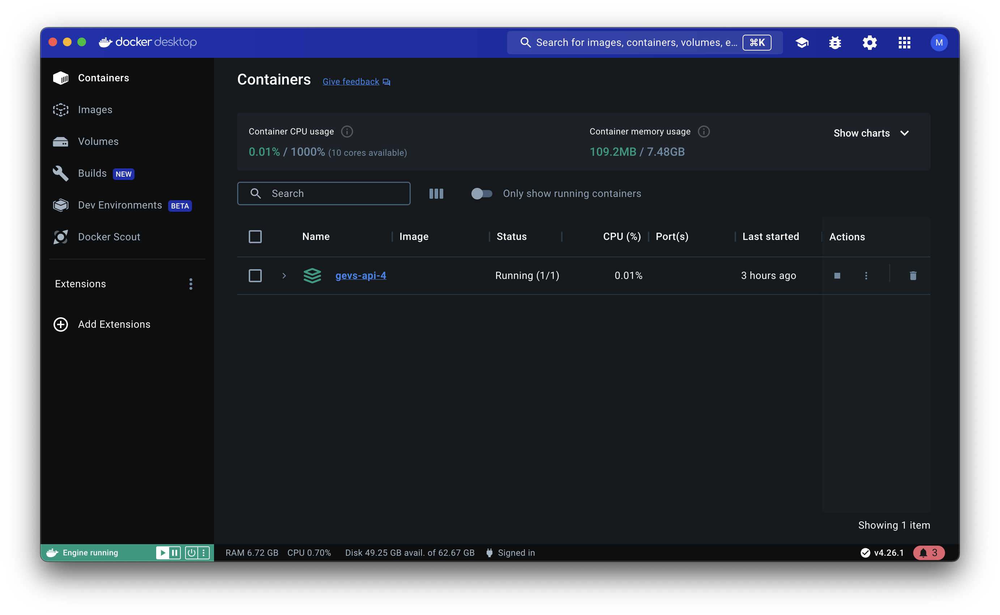
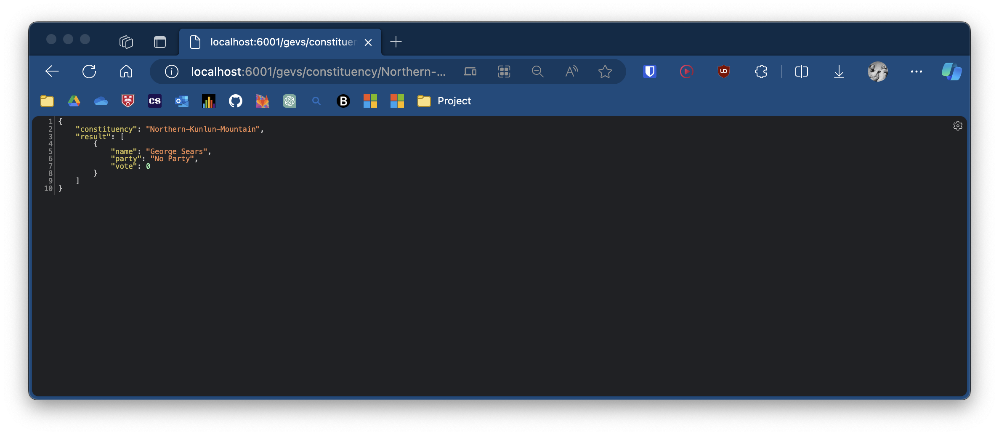
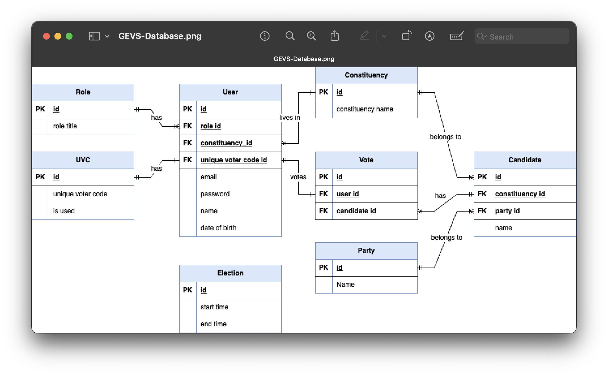

# General Election Voting System

Note: this application does not run in current state due to missing files that need to be re-added.

## Table of Contents

1. [Running the Application](#running-the-application)
   - [Backend](#backend)
   - [Frontend](#frontend)
2. [Interacting with the Application](#interacting-with-the-application)
   - [Logging in to the Election Commission Officer Account](#logging-in-to-the-election-commission-officer-account)
   - [Logging in as a Voter](#logging-in-as-a-voter)
   - [Election Commission Officer Dashboard](#election-commission-officer-dashboard)
   - [Registering](#registering)
   - [Voter Dashboard](#voter-dashboard)
   - [Navigating the Open Data Rest API](#navigating-the-open-data-rest-api)
3. [Miscellaneous Details](#miscellaneous-details)
   - [Tech Stack](#tech-stack)
   - [Database Design](#database-design)
   - [Security](#security)

## Running the Application

Please note that these instructions have been designed using a MacOS machine. In light of this, the instructions should still work for other operating systems. Docker is used to ensure the backend works on all machine configurations. 

At most, there may be some minor tweaks necessary to accomodate other operating systems. For instance, on Windows client computers, the execution of PowerShell scripts is disabled by default. To allow the execution of PowerShell scripts, which is needed for npm global binaries, you may need to set the following execution policy: 

    `Set-ExecutionPolicy -Scope CurrentUser -ExecutionPolicy RemoteSigned`

This may be needed when installing the Angular CLI. Please refer to the Angular documentation [here](https://angular.io/guide/setup-local) if any issues are encountered.

The instructions have been successfully tested on a MacOS machine with none of the necessary items preinstalled.

1. Download and unzip source code.

### Backend

1. Install [Docker](https://www.docker.com/) on your system.

2. Navigate to the `GEVS-API` directory and execute the following command:

       `docker-compose up`

   Note that this is within the solution directory, also named `GEVS-API`. The correct directory contains a `Program.cs` file.

   > CW2_mh652
   >> Software
   >>>GEVS-API
   >>>> GEVS-API <-- correct directory
   >>>>>Program.cs (amongst other files and directories)

   Once this command has finished, you will be able to see the container active in the `Containers` section on Docker

### Frontend

1. Install [Node.js](https://nodejs.org/en/download) on your system.

2. Execute the following command in the `GEVS-Frontend`:

       `npm install -g @angular/cli`

   On MacOS, you may need to grant yourself temporary privileges for this command to execute. To do this, prefix the command with `sudo`:

       `sudo npm install -g @angular/cli`.

3. Execute the following command: 

       `ng serve --open` 

   This will start the frontend in your web browser. The frontend will automatically open at [http://localhost:4200/login](http://localhost:4200/login).

## Interacting with the Application

When the application opens, it will navigate to the login page. 

### Logging in to the Election Commission Officer Account 

Enter the following details:
   - election@shangrila.gov.sr
   - shangrila2024$

### Logging in as a Voter

Note that logging into any other account is functionally the same, assuming the account already exists. A test voter account does already exist (details provided below) though it is recommended to make a new one. See the section on registering an account below.

- test@outlook.com
- Pass

### Election Commission Officer Dashboard

On the election officer dashboard, click `Start Election` and `End election` to start and end the election period respectively.  
   
   Note that although there is no feedback when the user starts an election, the functionality does work. This can be checked by logging in as a non-admin user before an election begins and then again afterwards.  

   There is feedback to the user when ending the election for the first time. The message will not disappear without reloading the page, which has the potential to cause some confusion about whether an election is active or not. To be sure, view the `console` via the `Developer Tools` pane on the browser.

### Registering

1. From the startup page, click `Don't have an account? Sign Up`. 
2. Enter your new account details accordingly. Below are some example details:
   - test@test.com
   - John Doe
   - 01/01/2000
   - Pass01
   - Naboo-Vallery
   - BQCRWTSG  

   Note that the UVCs are the same as those provided in the instruction sheet. Here are a few examples of valid UVCs: 

       `556JTA32 Q452KVQE KYMK9PUH WL3K3YPT JA9WCMAS Z93G7PN9 WPC5GEHA RXLNLTA6 7XUFD78Y DBP4GQBQ`

   Upon registering with valid details, the user will be navigated to the voter dashboard.

### Voter Dashboard

If an election is active, the user will be able to select a candidate to vote for. The application will not allow users to vote more than once or for candidates within different constituencies. Contextually appropriate error messages will be displayed). 

All candidates will be shown to the user regardless of constituency. The constituency of which a candidate belongs to is not shown to the user.

Here is the list of candidates, their constituency, and party:
- David Oh, Naboo-Vallery, Independent
- John Politician, Shangri-la-Town, Blue Party
- Steven Armstrong, Western-Shangri-la, Yellow Party
- George Sears, Northern-Kunlun-Mountain, Red Party

If no election is active, the user will not be able to vote, and will see a message informing them.

Also note that the user can only vote if you have logged in. Furthermore, the user must be logged in as a user that has not voted yet.

### Navigating the Open Data Rest API

- [http://localhost:6001/gevs/constituency/Northern-Kunlun-Mountain](http://localhost:6001/gevs/constituency/Northern-Kunlun-Mountain) 
- [http://localhost:6001/gevs/constituency/Naboo-Vallery](http://localhost:6001/gevs/constituency/Naboo-Vallery) 
- [http://localhost:6001/gevs/constituency/Shangri-la-Town](http://localhost:6001/gevs/constituency/Shangri-la-Town) 
- [http://localhost:6001/gevs/constituency/Western-Shangri-la](http://localhost:6001/gevs/constituency/Western-Shangri-la) 
- [http://localhost:6001/gevs/constituency/New-Felucia](http://localhost:6001/gevs/constituency/New-Felucia)

- [http://localhost:6001/gevs/results](http://localhost:6001/gevs/results)

For a full list of API endpoints used in this application, navigate to [http://localhost:6001/swagger/index.html](http://localhost:6001/swagger/index.html) while the backend is running.

## Miscellaneous Details

This section aims to provide a picture of the effort employed for this project, particularly regarding elements that do not comprise the user interface or frontend user functionality, such as database design and security.

### Tech Stack

- Backend: C#, ASP.NET Core 7.0,
- Database: SQLite
- Frontend: Angular

### Database Design

Below shows an entity relationship diagram of the database design employed in this project.

All relationships, primary keys, and foreign keys are accurately implemented as they are in this diagram. The relationships are as follows:
- A user can have one role.
- A user can live in one constituency.
- A user can use one unique voter code.
- A user can vote once.
- A role can belong to many users.
- A constituency can contain many users.
- A unique voter code can belong to one user.
- A vote can belong to one user.
- A vote can be for one candidate.
- A constituency can contain many candidates. 
- A candidate can belong to one constituency.
- A candidate can have many votes.
- A candidate can belong to one party.
- A party can have many candidates.

This database design along with business logic implemented in the backend ensures strong data and an opportunity to easily grow the application without poor database design holding it back.

### Security

The `HashingService.cs` code implements password hashing functionality to securely store the data in the database. The `HashingService` class includes two primary functionalities: 
- Hashing the password via the `HashPassword` method.
- Verifying the password against a hashed value via the `VerifyPassword` method.

The `HashPassword` method generates a random salt for each password using a cryptographically secure pseudorandom number generator. 

The hashing algorithm hashes passwords using PBKDF2 with HMAC-SHA256 as the pseudorandom function. The `numBytesRequested` for the PBKDF2 function is set to 256 bits.

The `VerifyPassword` method splits the stored hash and the salt, re-computes the hash of the input password using the same salt, and compares it with the stored hash. This ensures the actual passwords are never compared or stored directly — only the hashes.

Error handling is implemented to ensure the hashed password is stored correctly, alleviating the risk of certain attacks and system malfunctions. 
